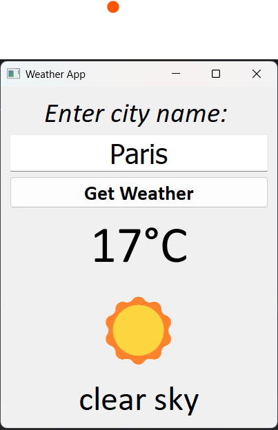
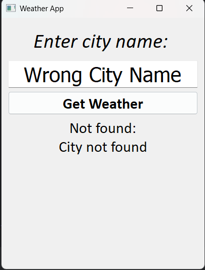

# Weather App

Это десктопное приложение на **Python (PyQt5)** для отображения текущей погоды в любом городе мира.  
Приложение использует **OpenWeatherMap API** и выводит температуру, описание и эмодзи, соответствующее погоде.

### Приложение обрабатывает:

- Некорректный ввод (неизвестный город)
- Проблемы с интернет-соединением
- Ошибки на стороне API (5xx)


## Функционал
- Ввод названия города
- Получение данных о погоде через OpenWeatherMap API
- Отображение:
  - температуры (в °C)
  - погодного описания (например, *clear sky*, *light rain*)
  - эмодзи соответствующее погоде
- Обработка ошибок (например, если город не найден или нет интернета)

## Структура проекта
```
.
│
├── weather_app.py                    # .py file с кодом приложения
├── requirements.txt                  # .txt file с зависимостями            
└── README.md                       
```


## Основные технологии

- **Python 3.10+**
- **PyQt5** — библиотека для графического интерфейса
- **requests** — библиотека для работы с API
- **OpenWeatherMap API** — источник данных о погоде


## Установка и запуск
1. Клонировать репозиторий:
   ```bash
   git clone https://github.com/mashashavelskaya/weather_app.git
   cd weather_app/
   ```
   После успешной установки репозитория себе на компьютер зайдите в папку "weather_app":
   ```bash
   cd weather_app/
   ```

2. Установить зависимости::
   ```bash
   pip install -r requirements.txt
   ```

3. Запустить приложение:
    ```bash
   python weather_app.py
   ```


## ⚠️ Важно перед использованием приложения

1. **Интернет-соединение обязательно**  
   Приложение обращается к онлайн-сервису погоды. Без интернета оно отображить погоду не будет.  

2. **Правила ввода названий городов**  
   - Вводите **названия городов только на английском языке**.  
   - Используйте **заглавную букву в начале** (например: `London`, `New York`, `Paris`).  
   - Соблюдайте общепринятую орфографию.  
   - Не используйте смайлики, цифры или случайные символы (например: `qwerty`, `123`, `Москва😂`).  

3. **Примеры корректного ввода**  
   `Berlin`  
   `Los Angeles`  
   `Tokyo`  
  **Примеры некорректного ввода**  
   `berlin`  
   `BERLIN`  
   `москва`  
## Интерфейс




## Идеи для улучшения:

- Красивые иконки погоды вместо эмодзи
- Тёмная тема интерфейса 
